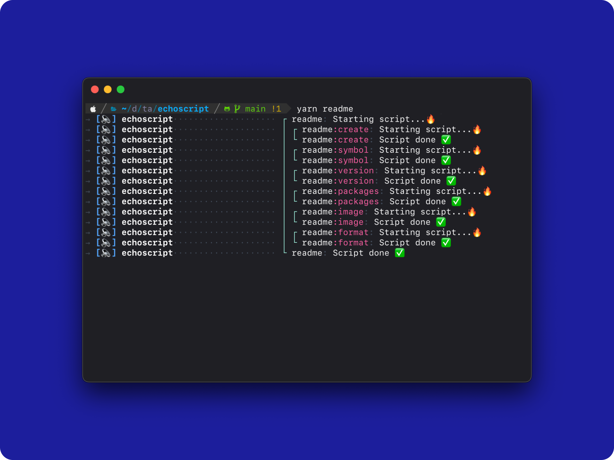
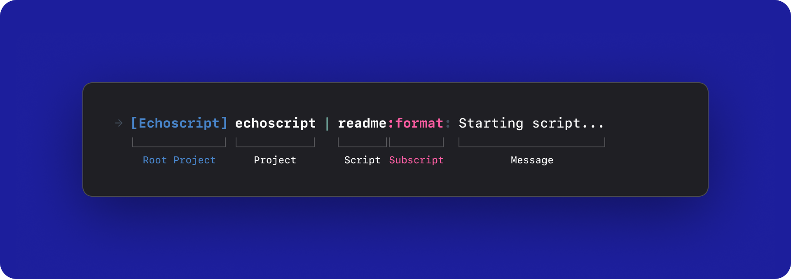

<!--
  Copyright 2023 Taeyoon Lee. All Right Reserved.

  This source code is licensed under the MIT license found in the
  LICENSE file in the root directory of this source tree.
-->

<!--
  This file is automatically generated based on resources/README.preset.md.
  Any direct modifications to this file will be lost.
  If changes are needed, please modify the resource/README.preset.md file.
-->

<!-- Hero Image -->
<p align="center">
  <a href="https://github.com/taeyoon0137/echoscript.git">
    
  </a>
</p>

<!-- Title -->
<h1 align="center">Echoscript</h1>
<p align="center">Echo for every script. For safety.</p>

<!-- Package Version -->
<p align="center">
  <a href="https://github.com/taeyoon0137/echoscript.git">
    
  </a>
</p>

<p align="center">
  <!-- Built with -->
  <a href="https://yarnpkg.com/getting-started/migration">
    
  </a>
  <a href="https://www.typescriptlang.org/">
    
  </a>
  <a href="https://eslint.org/">
    
  </a>
  <a href="https://github.com/lerna-lite/lerna-lite">
    
  </a>
  <br/>
  <!-- Working Workspaces or IDE -->
  <a href="https://code.visualstudio.com/">
    
  </a>
</p>

- [🔥 Getting Started](#-getting-started)
- [⚙️ Configuration](#️-configuration)
  - [`.echoscriptrc`](#echoscriptrc)
- [📦 Packages](#-packages)

## 🔥 Getting Started

Echoscript is a yarn plugin that logs each time an npm script runs, allowing users to clearly discern how far it has executed or where an error might have occurred.

You can install this plugin using the following command:

```shell
yarn plugin import https://raw.githubusercontent.com/taeyoon0137/echoscript/main/packages/yarn/plugin/bundle.js
```

After installing the plugin, if you run any command via script, you'll be able to see an echo as demonstrated below!



## ⚙️ Configuration



The structure of Echoscript is divided into Root Project, Project, Script, Subscript, and Message.

Initially, the Root Project is provided with the string `"🔈"`, but it can be modified through the `.echoscriptrc` file. The Project displays the `"name"` value of the package where the script runs, while Script and Subscript show the name of the executing script. If the Script contains a `":"`, it's recognized and differentiated as a Subscript based on this.

Messages typically occur when a script starts or finishes execution. However, more instances are planned to be added in the future.

### `.echoscriptrc`

Echoscript allows you to configure the plugin through a JSON-formatted .echoscriptrc file located in the project's root path.

For easy configuration, a predefined JSON schema can be used as follows:

```json
{
  "$schema": "https://raw.githubusercontent.com/taeyoon0137/echoscript/main/packages/types/schema/echoscriptrc.schema.json"
}
```

## 📦 Packages

> Current recent version is `0.1.1`

| Package Name                                 | Descripton                      | Version |
| :------------------------------------------- | :------------------------------ | :-----: |
| [@echoscript/types](./packages/types)        | Type definition for Echoscript. | `0.1.1` |
| [@echoscript/core](./packages/core)          | Core logic of Echoscript.       | `0.1.1` |
| [@echoscript/yarn-plugin](./packages/plugin) | Run echoscript via yarn plugin. | `0.1.1` |
